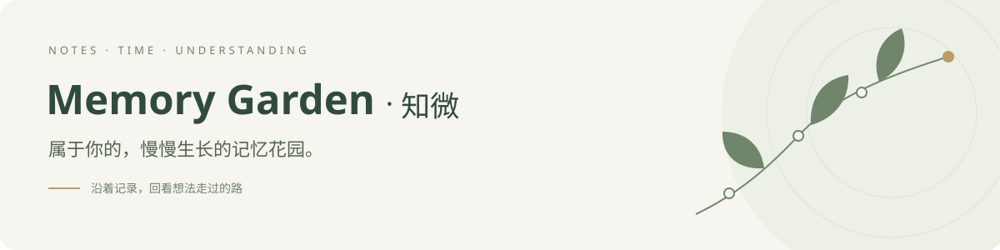
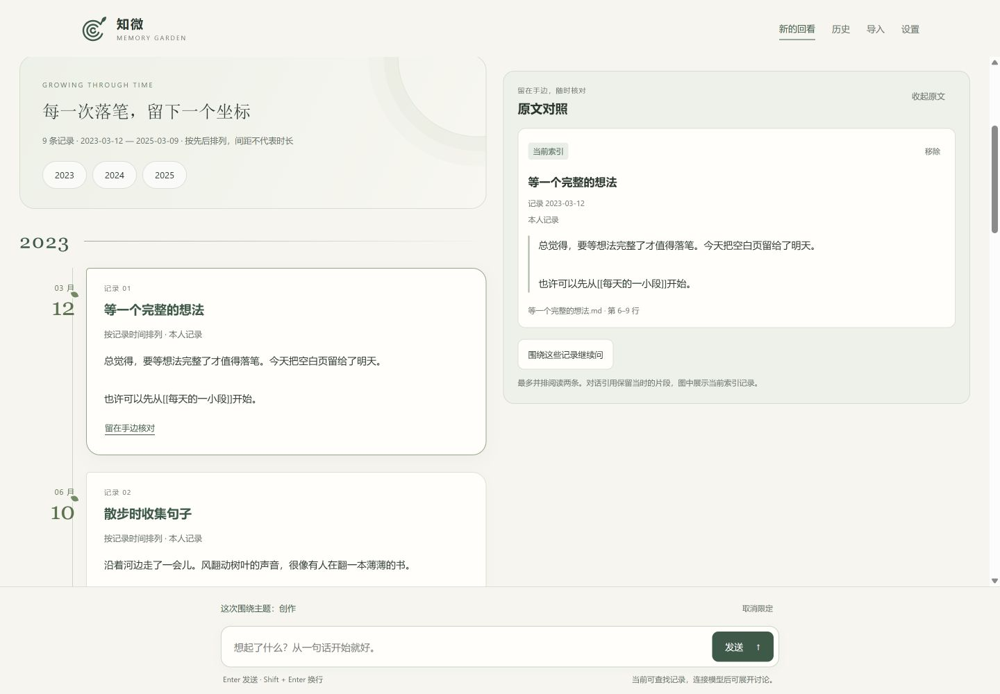
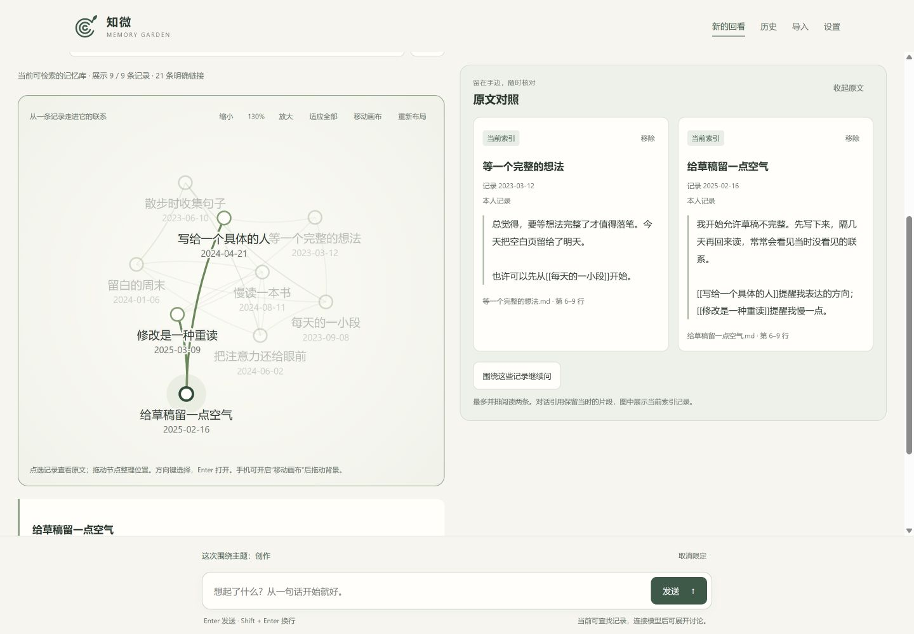
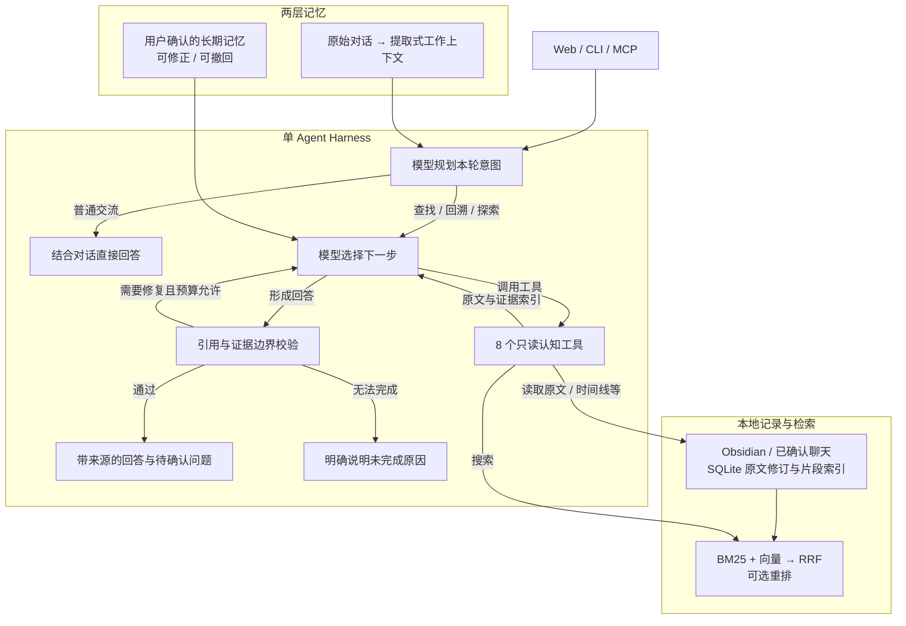

<p align="center">
  
</p>

<h1 align="center">Memory Garden · 知微</h1>

<p align="center">沿着自己的记录，回看一个想法如何延续与改变。</p>

<p align="center">
  <a href="#开始使用">体验示例</a> ·
  <a href="#认知回溯看见想法走过的路">认知回溯</a> ·
  <a href="#agent-如何工作">工作原理</a> ·
  <a href="#使用指南">使用指南</a>
</p>

<p align="center"><a href="LICENSE">MIT 开源</a> · 本机运行 · 原文可核对</p>

Memory Garden 是一个个人记忆助手。连接 Obsidian 笔记库，或导入自己选择的聊天记录，围绕一个主题找回原话、比较前后表达，并修正助手对你的理解。



<p align="center"><sub>实际界面 · 9 篇示例笔记 · 不含私人笔记 · 时间线间距不代表实际时长。</sub></p>

| 回看原话 | 比较前后 | 修正理解 |
| :--- | :--- | :--- |
| 找回当时写下的表达，打开来源核对语境。 | 把同一主题的记录沿时间展开，保留变化的线索与反例。 | 认可、补充或撤回解释，让自己的判断保持可修正。 |

> 自然对话需要连接生成模型；离线示例支持查找、规则对照和关系图浏览。连接云端模型时，相关片段可能发送至你配置的服务。

## 开始使用

需要 Python 3.12 和 [uv](https://docs.astral.sh/uv/getting-started/installation/)。

```powershell
git clone https://github.com/drephantom/memory-garden.git
cd memory-garden
uv sync --frozen
```

### 先体验示例

Windows 双击 `start-demo.bat`，浏览器打开 <http://127.0.0.1:8876>。
示例使用合成笔记，无需提供自己的笔记或 API Key。其他系统可按[示例体验指南](docs/DEMO.md)启动。

离线模式支持查找、规则对照和浏览关系图。要展开自然对话，需要连接生成模型。

### 使用自己的笔记

```powershell
Copy-Item .env.example .env
```

在 `.env` 中设置 `MG_VAULT_PATH` 为 Obsidian 笔记库的完整路径，然后启动：

```powershell
uv run memory-garden serve
```

打开 <http://127.0.0.1:8766>。Windows 也可以双击 `start-memory-garden.bat`。
进入后，点击 **连接笔记库**，可以连接另一个本机文件夹或切换已连接的库。
详细操作见[连接本地笔记库](docs/LOCAL_LIBRARIES.md)。

### 连接对话模型

打开 **设置 → 对话模型**，选择连接模型，填写服务地址、模型名称与 API Key。
保存后重启当前使用的服务入口。

模型连接后，问题、相关对话上下文和检索选出的记录片段可能发送到你配置的服务。
每个新连接的笔记库默认使用本地模式，不会继承其他库的模型权限。

## 认知回溯：看见想法走过的路

“我以前是怎么想的？”“现在有什么不同？”“这种不同可能从什么时候开始？”长期记录让这些问题有了可以回看的线索。Memory Garden 把同一主题在不同时间的表达放在一起，帮助你核对变化、保留反例，并辨认仍然无法回答的部分。

你可以指定一个主题，例如“我对自主判断的看法有变化吗？”，也可以问“有哪些值得回看的变化？”，让 Agent 在已有记录中寻找候选。这里的“发现”发生在你发起探索时；候选表示值得核对，不表示系统已经认定你发生了改变。

### 一次回溯会看到什么

下面是一个**虚构示例，用于说明阅读方式**：

| 回看的材料 | 可能读到的原话 |
| --- | --- |
| 较早的表达 | “只有别人认可我的选择，我才相信自己没有走错。” |
| 较近的表达 | “我更愿意先形成自己的判断，再听取别人的意见。” |
| 需要一并考虑的反例 | “重要选择前，我仍会先问朋友，借他们的视角检查盲点。” |

这些材料可以引出一个待核对的解释：**外部意见在你的决策中，可能从“获得认可”变成了“帮助检查”。** 但询问朋友本身并不说明你放弃了自主判断，较近的一条记录也未必代表你现在的看法。实际回溯会附上可打开的来源；你可以补充语境、修正解释，或暂时不作判断。

### 认知回溯如何实现

模型负责理解问题、选择工具和提出解释；程序负责限制证据范围、核对引用，并保存用户主动确认的判断。一次有明确主题的回溯通常沿着以下过程展开，工具顺序由 Agent 根据已有观察选择：

| 环节 | 机制与作用 |
| --- | --- |
| **确定这一轮的问题** | 区分普通交流、原文查找、主题回溯和开放探索，结合对话识别话题的延续或切换。普通交流直接回应，无需进入回溯流程。 |
| **找出可比较的记录** | 检索相关片段并建立主题时间线，寻找前后表达的候选配对。已有立场快照时优先使用快照，否则按主题、时间和措辞差异生成候选；排序信号不是“发生变化的概率”。 |
| **核对前后原话** | 变化端点必须来自本人的两条独立记录，有可核对的引文与先后时间。措辞不同只提供线索，还需要结合上下文判断是否在讨论同一件事。 |
| **进一步检验解释** | 当问题涉及变化原因且已有候选时，检索两端之间的经历，并分别检索支持与挑战假设的材料。反例检索使用扩展查询和词面信号排序，返回的仍是待核对材料；时间相邻不等于因果。 |
| **核验后呈现** | 模型提交结构化结论；程序检查来源是否在本轮观察过、引文是否逐字匹配，以及前后端点和证据角色是否合法。结果区分原话、解释与未知项；证据不足可以保留问题，核验失败会尝试有界修复或明确报告未完成。 |
| **交还给用户确认** | 你可以认可、补充、否认或暂时搁置。主动保存的判断成为可修正、可撤回的长期记忆，供后续同主题回溯参考；助手生成的解释不会自动变成你的永久标签。 |

**回溯的目标是形成有来源、可讨论的理解。** 记录可能不完整，候选检索可能遗漏，模型也可能误解语境；引用校验能够核对证据出处，不能证明解释本身正确。关于“现在的我是否仍这样想”，你的补充始终是必要的上下文。

## 可以做什么

- **围绕记录对话**：连接生成模型后，可以自然交流，也可以查找过去的原话、比较前后表达；引用可打开核对。
- **浏览时间线**：把同一主题的记录按时间放在一起，区分写下记录的日期与其中描述的事件时间。
- **探索关系图**：在局部图和全局图之间切换，缩放、拖动、搜索记录，并查看明确链接对应的原文。
- **管理自己的记忆**：确认、补充或撤回对回溯结果的判断。普通聊天不会自动成为永久的个人标签。
- **连接多个笔记库**：输入本机文件夹路径即可连接；每个库分别保存对话、记忆与模型设置。
- **导入聊天片段**：预览文件或粘贴微信片段，确认哪些发言属于自己，再决定是否加入检索。也支持连接已运行的 QQ 导出服务。
- **继续之前的对话**：历史页支持搜索与分页。离开页面不会取消已提交的回答请求。

## 在花园里回看

通过示例笔记，体验时间线、关系图与原文对照。

**关系图 · 从一条记录走进它的联系**

在全局图中缩放、拖动和选择记录，并排阅读两条原文。连线来自笔记中明确写出的链接。



时间线使用 [9 篇示例笔记](examples/showcase-vault)，全局图使用 306 篇合成笔记。选中一个节点，即可突出它的直接联系，并在旁边核对原文。

想亲自试试，可以在“连接笔记库”中输入本机 `examples/showcase-vault` 文件夹的完整路径。也可以生成全局图示例，再连接生成的文件夹：

```sh
python examples/generate_graph_showcase.py .local/graph-showcase-vault
```

## Agent 如何工作

Memory Garden 使用一个带只读工具的 Agent：先理解这一轮想聊什么，再决定是否查阅记录。回溯时，模型可以根据工具返回的证据继续查找，把原话、可能的解释和仍未确认的问题分开呈现。



- **有边界的工具循环**：步数、调用次数、超时与重复调用共同限制执行；引用不合规时最多进行一次修复，并共用剩余预算。模型失败会明确报告，离线规则模式独立提供。
- **可核对的检索**：通过 RRF 融合关键词与向量候选；默认向量使用本地哈希表示，可另行配置语义 Embedding 与重排服务。云端检索服务需单独启用，引用返回原始片段供用户核对。
- **压缩上下文，保留原话**：长对话从原始消息中提取工作上下文，不反复压缩旧摘要；整个模型请求受字符预算约束。长期记忆只采用用户确认的判断，支持修正与撤回，按笔记库隔离。
- **共享工具接口**：搜索、原文读取、主题时间线、变化候选、变化探索、区间事件、假设正反证据和用户判断，共 8 个只读工具；MCP 复用同一套工具实现。探索工具是否开放由本轮意图决定。

实现入口：[Agent 循环](src/memory_garden/agent.py) · [工具](src/memory_garden/tools.py) · [混合检索](src/memory_garden/retrieval.py) · [工作上下文](src/memory_garden/context.py) · [记忆管理](src/memory_garden/memory.py)。使用说明见[对话与记忆](docs/MEMORY.md)。

## 从一个问题开始

例如：

- “找找我以前关于写作的记录。”
- “自主判断这个主题，我的想法以前到现在有没有变化？”
- “这条记录里的说法，现在已经不太贴近我了。”

也可以点击“找一条回看线索”，或在关系图里选一篇记录开始浏览。
对话、时间线、关系图与记忆分别展示同一主题的不同侧面。

## 数据由你掌握

- 原始 Obsidian 笔记只读，应用不会改写原文。
- 索引、对话和导入副本保存在本机；这些文件需要像原始笔记一样妥善保管。
- 导入前先预览时间和发言人，明确选择本人身份与检索范围。
- 停止检索会保留导入副本和已有回答，不等同于彻底删除。
- 云端生成、Embedding 和 Rerank 分别配置；本地导入不代表后续云端模型调用也在本地。
- 助手的解释可以不同意，也可以暂时不判断。引用存在不代表解释一定正确。

## 使用指南

- [示例体验](docs/DEMO.md)
- [连接 Obsidian 笔记库与浏览关系图](docs/LOCAL_LIBRARIES.md)
- [对话、记忆与修正](docs/MEMORY.md)
- [微信与 QQ 聊天导入](docs/CHAT_IMPORT.md)
- [聊天导入与外部服务注意事项](docs/CHAT_IMPORT_SAFETY.md)

## 当前限制

- 目前面向单人、本机使用，暂不支持在线协作或跨设备同步。
- 笔记更新后，需要在设置中手动更新索引。
- 全局图最多展示 500 个节点和 3,000 条边；超出时显示省略量，可继续搜索。连线来自明确的笔记链接。
- 微信支持已有文件与主动粘贴，不直接读取或解密微信客户端。
- QQ 服务连接依赖外部程序及其版本，不能代替完整聊天备份。
- 图片、语音与视频暂不自动识别或转写。

## 许可

[MIT License](LICENSE)
